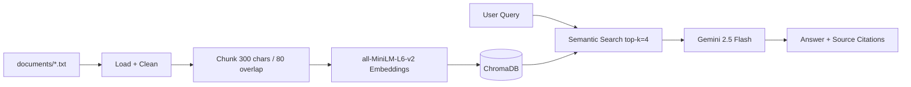

# Planning Spec — The Unofficial Guide (Texas State University)

## Domain

Texas State University student knowledge that lives outside official channels: Rate My Professor reviews for CS courses, r/txst housing and dining threads, and campus survival tips. This knowledge is valuable because it reflects real student experience (grading harshness, housing proximity, dining wait times) but is scattered across forums and hard to search with one question.

## Documents

| # | File | Source |
|---|------|--------|
| 1 | `documents/rmp_cs1428_smith.txt` | Rate My Professors — CS 1428 Smith |
| 2 | `documents/rmp_cs1428_jones.txt` | Rate My Professors — CS 1428 Jones |
| 3 | `documents/rmp_cs1428_garcia.txt` | Rate My Professors — CS 1428 Garcia |
| 4 | `documents/reddit_housing_bobcat_village.txt` | r/txst housing — Bobcat Village |
| 5 | `documents/reddit_housing_chautauqua.txt` | r/txst housing — Chautauqua Hall |
| 6 | `documents/reddit_housing_san_jacinto.txt` | r/txst housing — San Jacinto Hall |
| 7 | `documents/reddit_housing_off_campus.txt` | r/txst off-campus housing |
| 8 | `documents/reddit_dining_jones_hall.txt` | r/txst dining — Jones Dining Hall |
| 9 | `documents/reddit_dining_harris_hall.txt` | r/txst dining — Harris Dining Hall |
| 10 | `documents/reddit_campus_alkek_library.txt` | r/txst study spots — Alkek Library |
| 11 | `documents/reddit_campus_shuttle.txt` | r/txst transportation — Bobcat Shuttle |
| 12 | `documents/reddit_campus_parking.txt` | r/txst parking |
| 13 | `documents/reddit_academics_cs_advising.txt` | r/txst CS advising + SI |

Sources: [Rate My Professors](https://www.ratemyprofessors.com/), [r/txst](https://www.reddit.com/r/txst/). Text was manually collected and saved as plain `.txt` files (no live scraping).

## Chunking Strategy

- **Chunk size:** ~300 characters max; short review documents (under 300 chars of body text) stay as **one chunk per document**.
- **Overlap:** 80 characters when splitting longer documents (sentence-boundary splits).
- **Why:** Most sources are 1–3 sentence student reviews. One review = one retrievable opinion. The CS advising file is longer and gets split with overlap so "SI for CS 1428" and "Comal 307" can both appear in retrieval without losing context at boundaries.
- **Too small:** Fragments like "Prof. Jones also teaches" alone would fail comparison queries.
- **Too large:** Merging unrelated reviews would dilute embeddings and return parking tips for professor questions.

## Retrieval Approach

- **Embedding model:** `all-MiniLM-L6-v2` via `sentence-transformers` (local, free, no API limits).
- **Vector store:** ChromaDB (persistent, local).
- **Top-k:** 4 chunks per query (enough for professor comparisons; not so many that unrelated context leaks in).
- **Production tradeoffs:** For deployment I would weigh: domain-specific embeddings (e.g. fine-tuned on education text), multilingual support for international students, API cost vs. local GPU, and max context length for longer housing guides.

## Evaluation Plan

| # | Question | Expected correct answer |
|---|----------|-------------------------|
| 1 | What do students say about Prof. Smith for CS 1428? | Clear lectures, extra credit on labs, math-heavy exams, 4.5/5 rating. |
| 2 | Is Prof. Jones a good choice for CS 1428? | No — pop quizzes, strict attendance, harsh grading, 2/10 rating. |
| 3 | Which on-campus housing is near Alkek Library? | San Jacinto Hall, near Alkek and LBJ Student Center. |
| 4 | Which dining hall has the widest hours on main campus? | Jones Dining Hall (JDH). |
| 5 | Who is the best professor for MATH 2471 at TXST? | System should refuse — no MATH 2471 documents exist. |

## Anticipated Challenges

1. **Off-topic retrieval:** Queries about courses not in the corpus may still retrieve CS professor chunks by semantic similarity. Mitigation: strict grounding prompt + refusal when context is irrelevant.
2. **Chunk boundary splits:** Long advising document could split mid-sentence. Mitigation: sentence-aware splitting with 80-char overlap.
3. **Comparison questions:** Need multiple professor chunks in top-k. Mitigation: k=4 and separate one-review-per-file documents.

## AI Tool Plan

| Pipeline part | AI input | Expected output | My review |
|---------------|----------|-----------------|-----------|
| Ingestion + chunking | Documents list + chunking strategy above | `load_documents()`, `chunk_text()` | Verified chunk output manually |
| ChromaDB embedding | Architecture diagram + retrieval approach | `ingest_documents()`, collection setup | Confirmed metadata includes `source_file` |
| RAG generation | Grounding rules + citation format | `ask()` with system prompt, temperature=0 | Tightened prompt to refuse out-of-scope |
| Gradio UI | Milestone 5 interface spec | `app.py` web UI | Tested at localhost:7860 |
| Evaluation | 5 questions from this doc | `evaluate.py` + report | Judged accuracy manually in README |

## Architecture

| Stage | Tool |
|-------|------|
| Document Ingestion | Python `pathlib`, regex cleaning |
| Chunking | Sentence-boundary splitter in `ingest.py` |
| Embedding + Vector Store | sentence-transformers + ChromaDB |
| Retrieval | ChromaDB `collection.query()` |
| Generation | google-genai `gemini-2.5-flash`, temperature=0.0 |
